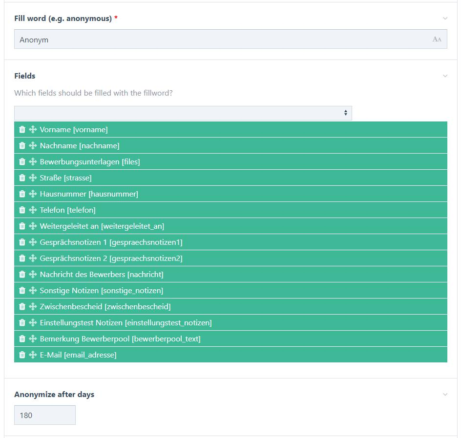

# Anonymize fields in ProcessWire

This module allows you to select fields that get anonymized after a defined period of time.

Anonymization refers to either replacing field values with a configurable fill word, or removing stored data altogether. The time period after which page content gets anonymized can be configured (default is 60 days), and anonymized fields can be selected manually via module config screen.

Behind the scenes LazyCron is used to trigger the anonymization process, which makes the whole process completely automatic.

Screenshot of the Anonymize fields module config screen. Displays configuration fields for fill word, fields, and anonymization period.

